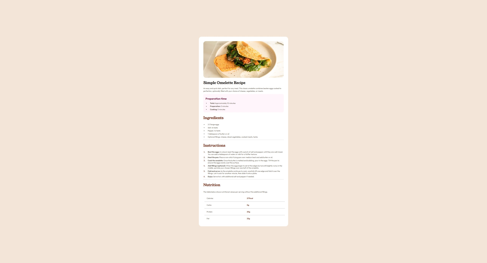
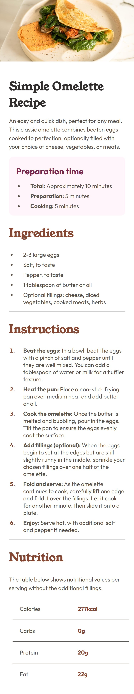

# Frontend Mentor - Recipe page solution

This is a solution to the [Recipe page challenge on Frontend Mentor](https://www.frontendmentor.io/challenges/recipe-page-KiTsR8QQKm). Frontend Mentor challenges help you improve your coding skills by building realistic projects.

## Table of contents

- [Overview](#overview)
  - [The challenge](#the-challenge)
  - [Screenshot](#screenshot)
  - [Links](#links)
- [My process](#my-process)
  - [Built with](#built-with)
  - [What I learned](#what-i-learned)
  - [Continued development](#continued-development)
  - [Useful resources](#useful-resources)
- [Author](#author)
- [Acknowledgments](#acknowledgments)

## Overview

This project is a responsive recipe page built as part of a Frontend Mentor challenge. The goal was to recreate a given design using modern web development practices. The page displays a recipe with its image, preparation time, ingredients, instructions, and nutritional information. The focus was on semantic HTML, accessibility, and clean, maintainable CSS. The project is suitable for beginners looking to practice layout techniques and component structuring.

### Screenshot

### Links

- Solution URL: [Add solution URL here](https://github.com/remainhumble/recipe-page)
- Live Site URL: [Add live site URL here](https://remainhumble.github.io/recipe-page/)

## My process

1. **Project setup:** Initialized the project with a basic file structure and installed dependencies.
2. **HTML structure:** Created the semantic HTML layout for the recipe page, ensuring accessibility and logical content flow.
3. **Styling:** Applied CSS custom properties, Flexbox, and Grid to achieve the responsive design, starting with mobile-first styles.
4. **Testing:** Checked the layout and functionality across different devices and browsers.
5. **Refinement:** Polished the design, improved accessibility, and optimized the code for readability and performance.

### Built with

- Semantic HTML5 markup
- CSS custom properties
- Flexbox
- Mobile-first workflow

### What I learned

During this project, I deepened my understanding of semantic HTML and accessibility best practices. I learned how to structure content meaningfully using elements like unordered lists, ordered lists, and table element and its children, which improves screen reader support.

I also practiced using CSS custom properties for consistent theming and easier maintenance. Using media queries helped me create a responsive layout that adapts smoothly to different screen sizes.

Overall, this project reinforced the importance of clean, maintainable code and thoughtful design choices.

### Continued development

In future projects, I want to continue improving my skills in the following areas:

- **Advanced CSS techniques:** Deepen my understanding of CSS Grid, Flexbox, and responsive design patterns to create more complex layouts.
- **Accessibility:** Focus on making web pages more accessible by using ARIA roles, better color contrast, and keyboard navigation.

By focusing on these areas, I hope to build more polished, user-friendly, and maintainable frontend projects.

### Useful resources

- [Bro Code - YouTube](https://www.youtube.com/@BroCodez) - Coding bootcamps HATE him!
  See how he can teach you to code.
  His channel is dedicated to providing free education to those that cannot afford college, bootcamps, and overpriced crap coding gurus try to sell you.
- [Frontend Mentor Community](https://www.frontendmentor.io/community) - Great place to ask questions and see how others approach similar challenges.
- [Google Fonts](https://fonts.google.com/) - Used for selecting and implementing web fonts in the project.
- [GitHub Docs - Getting Started with Git](https://docs.github.com/en/get-started/quickstart) - Useful for managing version control throughout the project.

## Author

- Frontend Mentor - [@remainhumble](https://www.frontendmentor.io/profile/remainhumble)
- X(formerly Twitter) - [@thiflan120699](https://x.com/thiflan120699)
